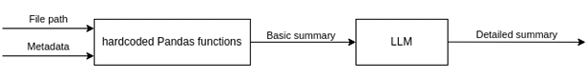
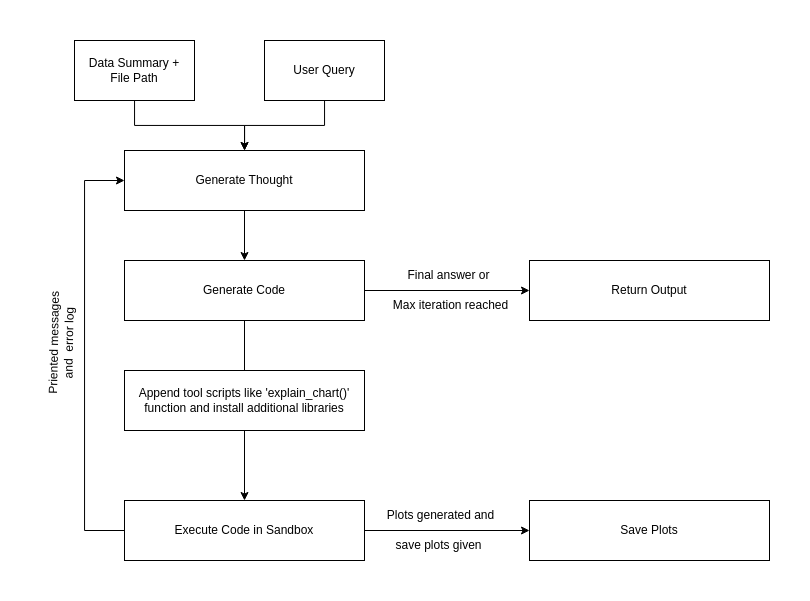
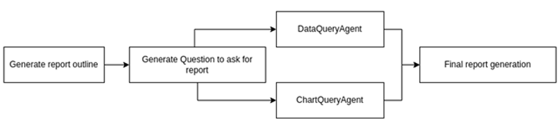
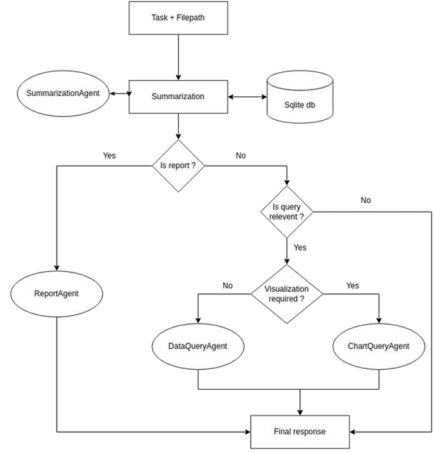

# Data Analysis AI Agent

The **Data Analysis AI Agent** is an intelligent system designed to automate the process of dataset understanding and analysis. It leverages various specialized agents to execute data queries, generate visualizations, perform iterative code execution, and generate comprehensive reports autonomously.


## Components

### 1. Summarization Agent
The **Summarization Agent** extracts fundamental statistics and metadata from datasets. It retrieves column-wise statistics, utilizes user-provided metadata (if available), and leverages LLMs to generate meaningful descriptions of columns.



*Key Features:*
- Extracts basic statistics (e.g., missing values, unique values).
- Generates column descriptions using LLM.

### 2. Code Agent
The **Code Agent** autonomously generates, executes, and debugs code in a controlled environment. It iteratively refines code and fixes errors until the desired output is achieved. This agent is key in executing data queries and generating insights.



*Key Features:*
- Generates code based on user input.
- Executes code in a sandboxed environment.
- Returns execution results or error logs.

### 3. Data Query Agent
A subclass of **Code Agent**, the **Data Query Agent** specializes in querying datasets. It generates Pandas code to execute complex queries, breaks down user queries into smaller tasks, and refines results iteratively.

*Key Features:*
- Handles complex data queries.
- Utilizes dataset summaries for accuracy.
- Works with the **Summarization Agent** to ensure correct query execution.

### 4. Chart Query Agent
The **Chart Query Agent** focuses on generating **Matplotlib** visualizations. It follows a similar workflow as the **Data Query Agent**, but instead of returning images, it sends textual chart metadata (e.g., axis labels, plot details) to the LLM.

*Key Features:*
- Generates visualizations iteratively.
- Returns textual chart metadata for further analysis.

### 5. Report Agent
The **Report Agent** generates comprehensive reports based on the dataset. It plans the report structure, extracts insights from data and charts, and generates the report document in Markdown or PDF format.



*Key Features:*
- Plans report structure.
- Extracts insights from queries and charts.
- Generates the final report in multiple formats.

## Workflow

The system’s workflow is organized with langgraph and structured as follows:



1. **User Input**: The user provides the dataset and specifies the task.
2. **Summarization Phase**: The **Summarization Agent** extracts metadata from the dataset.
3. **Task Execution**: The **Data Query Agent** or **Chart Query Agent** processes user requests.
4. **Report Generation**: The **Report Agent** compiles the results into a final report.
5. **Final Output**: The results are returned to the user, with options for saving them as files.


## Summary Storage and Caching

To minimize redundant calls to the LLM, dataset summaries are stored in an **SQLite** database. This caching mechanism ensures improved performance by reusing previously computed metadata.

## Folder Structure

```
data_analysis_system
├─ .dockerignore
├─ Dockerfile
├─ README.md
├─ app.py
├─ compose.yaml
├─ data
│  ├─ ...
├─ notebooks
│  ├─ ...
├─ pyproject.toml
├─ requirements.txt
├─ src
│  ├─ __init__.py
│  ├─ agents
│  │  ├─ __init__.py
│  │  ├─ chart_query_agent.py
│  │  ├─ code_agent.py
│  │  ├─ data_query_agent.py
│  │  ├─ report_agent.py
│  │  └─ summarization_agent.py
│  ├─ config
│  │  ├─ __init__.py
│  │  └─ db.py
│  ├─ nodes
│  │  ├─ __init__.py
│  │  ├─ chart_node.py
│  │  ├─ data_query_node.py
│  │  ├─ grade_user_query.py
│  │  ├─ grade_visualization_requirement.py
│  │  ├─ report_node.py
│  │  ├─ summarization_node.py
│  │  └─ transform_query.py
│  ├─ tools
│  │  ├─ __init__.py
│  │  ├─ decide_to_continue.py
│  │  ├─ decide_to_report.py
│  │  ├─ decide_to_visualize.py
│  │  ├─ generate.py
│  │  ├─ query_rewriter.py
│  │  ├─ summary.py
│  │  ├─ user_query_grader.py
│  │  └─ visualization_requirement_grader.py
│  └─ utils
│     ├─ __init__.py
│     ├─ additional_source_code.py
│     ├─ app_handlers.py
│     ├─ e2b_executor.py
│     ├─ extract_chart_data.py
│     ├─ graph.py
│     ├─ helper.py
│     ├─ llm.py
│     ├─ logging.py
│     ├─ models.py
│     └─ prompts.py
└─ test
   ├─ Test_query_plots
   │  └─...
   ├─ agents_testing.ipynb
   ├─ movie_data_report.pdf
   └─ test_results.xlsx
```

## How to Run

Clone this repository
```bash
git clone https://github.com/yourusername/data-analysis-agent.git
cd data-analysis-agent
```

### Using Python

1. Create a virtual environment:

   ```bash
   python -m venv venv
   ```

2. Activate the virtual environment:

   - On macOS/Linux:
     ```bash
     source venv/bin/activate
     ```

   - On Windows:
     ```bash
     venv\Scripts\activate
     ```

3. Install the dependencies:

   ```bash
   pip install -r requirements.txt
   ```

4. Run the application using Streamlit:

   ```bash
   streamlit run app.py
   ```

   This will launch the application at `http://localhost:8501`.

### Using Docker

To run the application with Docker, follow these steps:

1. Build the Docker image:

   ```bash
   docker build -t data-analysis-agent .
   ```

2. Start the application using Docker Compose:

   ```bash
   docker compose up --build -d
   ```

   This will start the application in the background. You can access the service at `http://localhost:8000` or interact with the system through `app.py`.


## Conclusion

The **Data Analysis AI Agent** streamlines the process of dataset analysis through automation. With its modular architecture, iterative execution, and caching mechanisms, it enhances efficiency and reliability. The system is highly flexible, allowing for scalable data analysis workflows using LLMs, Pandas, and Matplotlib.

